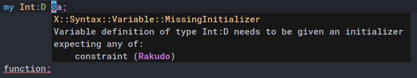

flymake-rakudo
==============

Make Flymake syntax-check Raku code.



Installation
------------

With [`use-package`][use-package] in your init file:

```el
(use-package flymake-rakudo
  :ensure t
  :hook
  (raku-mode . flymake-rakudo-setup))
```

Or manually from [MELPA][] with <kbd>M-x package-refresh-contents</kbd>
and <kbd>M-x package-install RET flymake-rakudo</kbd>.

Usage
-----

Just use Flymake as usual in [Raku Mode][raku-mode].

License
-------

This program is free software: you can redistribute it and/or modify it under
the terms of the GNU General Public License as published by the Free Software
Foundation, either version 3 of the License, or (at your option) any later
version.

This program is distributed in the hope that it will be useful, but WITHOUT ANY
WARRANTY; without even the implied warranty of MERCHANTABILITY or FITNESS FOR A
PARTICULAR PURPOSE.  See the GNU General Public License for more details.

You should have received a copy of the GNU General Public License along with
this program.  If not, see http://www.gnu.org/licenses/.

[use-package]: https://github.com/jwiegley/use-package
[MELPA]: https://melpa.org/
[raku-mode]: https://github.com/Raku/raku-mode
